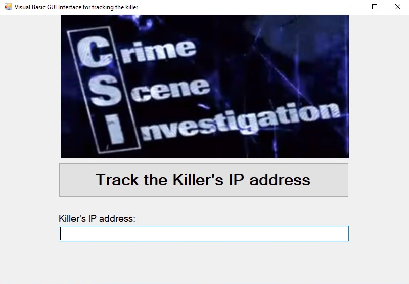

# Visual Basic GUI IP Tracker
This is a GUI Interface created with Visual Basic that can be used to track the killer's IP address.

Reference:
https://www.youtube.com/watch?v=hkDD03yeLnU

# screenshots

# build
You can download precompiled x86 windows binaries for tracking the killer. When tracking killer ipadresses installing visual studio can be a lot and delay first responders from receiving the critical information they need to track the killer. 

WARNING: If you're using arm or running on a 64bit only os - cough macos - you have my condolences.

DISCLAIMER: If you are the killer do not use this!

